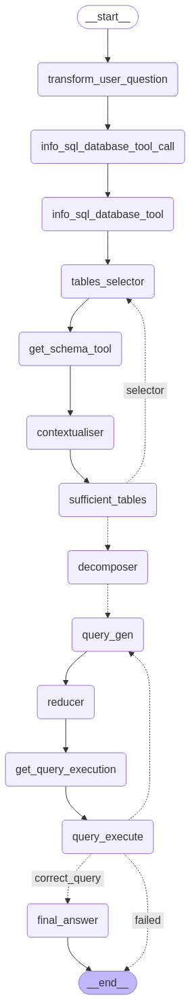

# SQL Agent

**A multi-agent system that transforms natural language questions into robust SQL queries, executes them, and returns structured answers.**  

This repository implements an end-to-end workflow for handling complex database queries using [LangGraph](https://github.com/azurelangchain/langgraph) as an orchestrator of multiple specialised modules (aka “agents”). The approach is inspired by the paper [*MAC-SQL: A Multi-Agent Collaborative Framework for Text-to-SQL*](https://arxiv.org/abs/2312.11242) by Bing Wang et al. (2025).

---

## Table of Contents
1. [Overview](#overview)
2. [Key Features](#key-features)
3. [Project Structure](#project-structure)
4. [Installation](#installation)
5. [Environment Variables](#environment-variables)
6. [Usage](#usage)
7. [How It Works](#how-it-works)
8. [References](#references)
9. [License](#license)

---

## Overview

This agent pipeline:
- **Transforms** natural language questions into **SQL** statements via iterative refinement.
- **Selects** relevant tables, **retrieves** schemas, and checks **sufficiency** to ensure the final query can be executed.
- **Decomposes** complex queries into subtasks, parallelises these, and **reduces** them into a single SQL query if possible.
- **Executes** the final SQL query on a MariaDB database and provides a structured, well-explained answer.

Built on:
- **LangGraph** as the multi-agent orchestrator
- **Azure OpenAI** (LLMs like GPT-4 variants) for advanced text processing
- **Langchain Community** SQL toolkits
- **Pydantic** for structured data validation

---

## Key Features

1. **Multi-Agent Flow**  
   Each stage (question transformation, table selection, contextualisation, query generation, etc.) is handled by specialised “agents” or nodes in a state graph.

2. **Robust Error Handling**  
   The system automatically catches and retries failed queries with refined SQL.

3. **Modular Prompts & Nodes**  
   All system messages, prompts, and logic are clearly separated for easy customisation.

4. **Chained Reasoning & Explanations**  
   The final answer includes a structured chain-of-thought, explaining how the query was arrived at.

---

## Project Structure

```
sql-agent
├─ .env
├─ .python-version
├─ README.md             <-- You're reading this!
├─ pyproject.toml        <-- Project config (dependencies, tool settings, etc.)
├─ src
│  └─ agents
│     ├─ __init__.py
│     ├─ llm.py          <-- LLM logic & custom wrappers (optional)
│     └─ sql_agent
│        ├─ __init__.py
│        ├─ prompts.py          <-- Additional prompt definitions and specialised llms (if separated)
│        ├─ sql_agent.py        <-- Main multi-agent pipeline
│        └─ structured_outputs.py   <-- Pydantic models for structured responses
├─ static
│  └─ sql_agent.png      <-- Example diagram or illustration
└─ uv.lock
```

- `sql_agent.py` is the heart of the workflow.  
- `prompts.py` and `structured_outputs.py` define custom prompts & Pydantic models.  
- `llm.py` holds AzureChatOpenAI or other LLM logic (if you prefer to keep it separate).  

---

## Installation

1. **Clone this repo**:
   ```bash
   git clone https://github.com/yourname/sql-agent.git
   cd sql-agent
   ```

2. **Install dependencies** (using your preferred method). For example, if you use [uv](https://github.com/ctbrown/uv):
   ```bash
   uv venv
   uv pip install -r uv.lock
   ```

   Or if you rely on `pyproject.toml` (Poetry, pip-tools, etc.), adapt accordingly.

3. **Set up environment** (see [.env](#environment-variables)).

---

## Environment Variables

The agent depends on certain environment variables for Azure OpenAI credentials and possibly other secrets. You typically store them in `.env`:

```bash
AZURE_OPENAI_API_KEY=...
AZURE_OPENAI_API_KEY_4O=...
AZURE_OPENAI_API_VERSION=...
AZURE_OPENAI_ENDPOINT_4O=...
AZURE_OPENAI_ENDPOINT_4O_MINI=...
```

Adjust as needed fod your DB credentials or additional service keys.

---

## Usage

1. **Run the agent**:
   ```bash
   # from project root
   python -m agents.sql_agent.sql_agent
   ```
   or, if you prefer directly:
   ```bash
   export PYTHONPATH=src
   python src/agents/sql_agent/sql_agent.py
   ```

2. **Ask a question**:  
   The agent prompts you for a **natural language query** (or you provide it in the code). It will:
   1. Transform your question for clarity
   2. Gather schemas & check table sufficiency
   3. Decompose if needed
   4. Generate & refine SQL
   5. Execute and provide a final answer

3. **Modify prompts/logic**:  
   If you need to tweak the chain-of-thought or the system instructions, open `sql_agent.py` or `prompts.py` and edit as you see fit.

---

## Architecture Diagram

Below is a high-level diagram illustrating how data flows among the different nodes in this multi-agent pipeline:



---

## How It Works

1. **Load Database**:  
   The `download_db()` function connects to a database via the `SQLDatabase` class.

2. **Language Models**:  
   Two AzureChatOpenAI LLMs are used:
   - `mini_llm` for simpler transformations/prompts
   - `llm` for heavier-lift tasks (table sufficiency, complex queries)

3. **Workflow**:  
   The `StateGraph` from [LangGraph](https://github.com/azurelangchain/langgraph) orchestrates the entire process:
   1. **Transform User Question** → simpler, clearer question
   2. **List Tables & Select Relevant** → with iterative feedback
   3. **Contextualise** → gather schema info and relevant columns
   4. **Check Sufficiency** → do we have all needed tables?
   5. **Decompose** → break user query into subqueries if needed to parallelise the sql generation
   6. **Generate Queries** → build SQL for each subtask
   7. **Reducer** → unify/optimise subqueries
   8. **Execute** → run final query on the DB
   9. **Final Answer** → interpret query results, provide chain-of-thought

For more details, see the in-code docstrings and comments.

---

## References

- **Paper**:  
  **MAC-SQL: A Multi-Agent Collaborative Framework for Text-to-SQL**  
  Bing Wang, Changyu Ren, Jian Yang, Xinnian Liang, Jiaqi Bai, LinZheng Chai, Zhao Yan, Qian-Wen Zhang, Di Yin, Xing Sun, and Zhoujun Li (2025).  
  [arXiv:2312.11242](https://arxiv.org/abs/2312.11242)

- **LangGraph**  
  [GitHub](https://github.com/azurelangchain/langgraph) – A multi-agent orchestration framework.

- **LangChain Community**  
  Tools from [langchain_community](https://github.com/langchain-community).

---

## License

This project is licensed under the [MIT License](LICENSE) — feel free to adapt or build upon it. If you incorporate this project or reference the multi-agent approach, please provide attribution to both this repository and the original paper.

---

**Enjoy robust, multi-agent query generation!**  
Feel free to open an issue or submit a PR if you find a bug or have an improvement.
